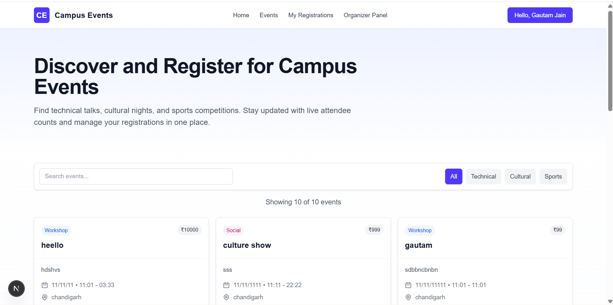

# Campus Events Platform - Interactive README

## 📋 Table of Contents
- [Project Overview](#project-overview)
- [Features](#features)
- [User Roles](#user-roles)
- [Screens & Functionality](#screens--functionality)
- [Technical Details](#technical-details)
- [Installation & Setup](#installation--setup)
- [Usage Guide](#usage-guide)

## 🎯 Project Overview

The **Campus Events Platform** is a comprehensive web application designed to streamline event management and registration within educational institutions. It enables students to discover, register, and track campus events while providing organizers with tools to create and manage events efficiently.

---

## ✨ Key Features

### 🔍 Event Discovery & Search
- **Smart Search**: Find events by title, category, or keywords
- **Category Filtering**: Browse events by Technical, Cultural, Sports, or Social categories

### 📝 Event Management
- **Event Creation**: Comprehensive event setup with title, description, category, date, and capacity
- **Organizer Dashboard**: Centralized management for created events

### 👤 User Management
- **Dual Role System**: Separate interfaces for Students and Organizers
- **Profile Management**: Personal information and event history
- **Registration Tracking**: View past and upcoming event registrations

---

## 👥 User Roles

### 🎓 Student
- Browse and search events
- Register for events
- Manage personal registrations
- View event history 

### 🎯 Organizer
- Create and publish events
- Manage event details and capacity
- Track registration numbers
- Monitor event performance

---

## 📱 Screens & Functionality

### 1. 🏠 Home Page
**Purpose**: Main landing page for event discovery

**Features**:
- Event search bar with real-time filtering
- Category-based event filtering (All, Technical, Cultural, Sports)
- Event cards showing:
  - Event title and brief description
  - Date, time, and location
  - Current attendance and capacity
  - Quick action buttons (View Details, Register)

**Interactive Elements**:
- `Search events...` - Live search functionality
- Category tabs - Filter events by type
- `View Details` - Event detailed view
- `Register` - Quick registration

### 2. 🔐 Authentication System

#### Login Screen

**Fields**:
- Email address
- Password
- Navigation to Sign Up page

#### Sign Up Screen

**Registration Fields**:
- Full Name
- Email Address
- Password & Confirm Password
- Role Selection (Student/Organizer)

### 3. 📊 Student Dashboard

**Profile Section**:
- User avatar and personal information
- Event statistics (Total Events, Attended, Upcoming)

**Registered Events**:
- Chronological list of registered events
- Event status indicators (Attended, Confirmed, Upcoming)
- Registration dates and event details
- Category badges for quick identification

### 4. 🎪 Event Registration

**Event Overview**:
- Event title and detailed description
- Key information (Date, Time, Location, Organizer, Price)
- Current attendance counter

**Registration Form**:
- Full Name
- Email Address
- Phone Number
- Student ID
- Department selection
- Registration summary confirmation

### 5. ⚡ Organizer Dashboard

**Management Tools**:
- `Create New Event` button
- Event statistics and overview
- List of created events with:
  - Event dates and times
  - Attendance numbers
  - Pricing information

### 6. 🎫 Event Creation

**Required Fields**:
- Event Title
- Description
- Category selection
- Date and time
- Maximum attendees capacity

### 7. 🔍 Search Results

**Features**:
- Shows number of matching events
- Maintains event card consistency
- Preserves all event information and actions

---

## 🛠 Technical Details

### Frontend Components
- **Responsive Design**: Works across desktop and mobile devices
- **Interactive UI**: Real-time updates and hover effects
- **Form Validation**: Client-side input validation
- **State Management**: User sessions and event states

}

### Quick Start
1. **Access the Platform**: Navigate to the application URL
2. **Create Account**: Click "Sign Up" and complete registration
3. **Choose Role**: Select Student or Organizer based on your needs
4. **Start Exploring**: Browse events or create your first event

---

## 📖 Usage Guide

### For Students 🎓

1. **Discover Events**
   - Use search bar to find specific events
   - Filter by categories that interest you
   - Check attendance numbers for popular events

2. **Register for Events**
   - Click "Register" on any event card
   - Complete the registration form
   - Receive confirmation of your registration

3. **Manage Your Events**
   - View all registered events in your dashboard
   - Track attendance status
   - Monitor upcoming events

### For Organizers 🎯

1. **Create Events**
   - Navigate to Organizer Dashboard
   - Click "Create New Event"
   - Fill in all required event details
   - Set appropriate capacity and pricing

2. **Manage Events**
   - View all created events in dashboard
   - Monitor registration numbers
   - Update event details as needed

3. **Track Performance**
   - Monitor attendance rates
   - Analyze event popularity
   - Make data-driven decisions for future events

**🎉 Happy Event Planning!**
